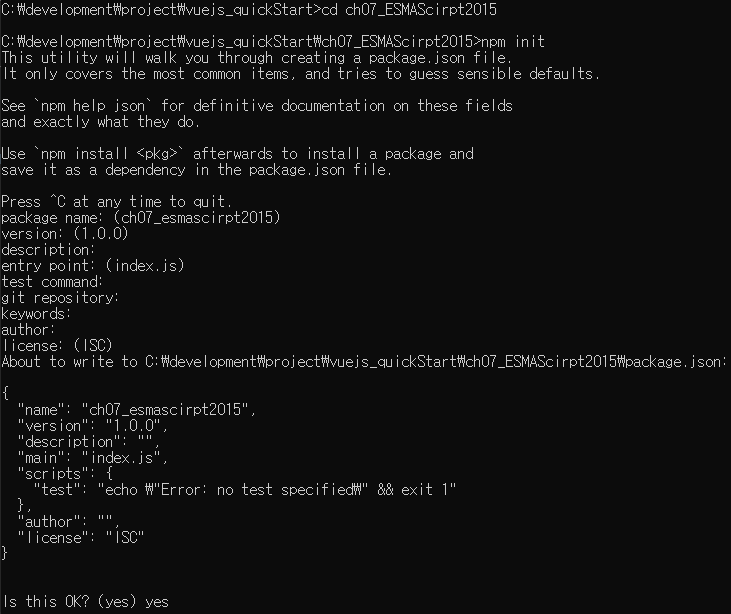

Vue.js Quick Start 
======================

<!-- TOC -->

- [01 시작하기](#01-시작하기)
    - [1.1 Vue.js란?](#11-vuejs란)
    - [1.2 개발 환경 설정](#12-개발-환경-설정)
        - [1.2.1 Node.js 설치](#121-nodejs-설치)
        - [1.2.2 Visual Studio Code 설치](#122-visual-studio-code-설치)
        - [1.2.3 크롬 브라우저 및 Vue.js devtools 설치](#123-크롬-브라우저-및-vuejs-devtools-설치)
        - [1.2.4 Vue-CLI 설치](#124-vue-cli-설치)
    - [1.3 첫 번째 Vue.js 애플리케이션](#13-첫-번째-vuejs-애플리케이션)
- [02 Vue.js 기초](#02-vuejs-기초)
    - [2.1 hellovuejs 예제 분석](#21-hellovuejs-예제-분석)
    - [2.2 기본 디렉티브](#22-기본-디렉티브)
        - [2.2.1 v-text, v-html 디렉티브](#221-v-text-v-html-디렉티브)
        - [2.2.2 v-bind 디렉티브](#222-v-bind-디렉티브)
        - [2.2.3 v-model 디렉티브](#223-v-model-디렉티브)
        - [2.2.4 v-show, v-if, v-else, v-else-if 디렉티브](#224-v-show-v-if-v-else-v-else-if-디렉티브)
    - [2.3 v-for 디렉티브 (반복 렌더링 디렉티브)](#23-v-for-디렉티브-반복-렌더링-디렉티브)
    - [2.4 기타 디렉티브](#24-기타-디렉티브)
    - [2.5 계산형 속성](#25-계산형-속성)
- [03 Vue 인스턴스](#03-vue-인스턴스)
    - [3.1 el, data, computed 옵션](#31-el-data-computed-옵션)
    - [3.2 메서드](#32-메서드)
    - [3.3 관찰 속성](#33-관찰-속성)
    - [3.4 v-cloak 디렉티브](#34-v-cloak-디렉티브)
    - [3.5 Vue 인스턴스 라이프 사이클](#35-vue-인스턴스-라이프-사이클)
- [04 이벤트 처리](#04-이벤트-처리)
    - [4.1 인라인 이벤트 처리](#41-인라인-이벤트-처리)
    - [4.2 이벤트 핸들러 메서드](#42-이벤트-핸들러-메서드)
    - [4.3 이벤트 객체](#43-이벤트-객체)
    - [4.4 기본 이벤트](#44-기본-이벤트)
    - [4.5 이벤트 전파와 버블링](#45-이벤트-전파와-버블링)
    - [4.6 이벤트 수식어](#46-이벤트-수식어)
- [05 스타일](#05-스타일)
    - [5.1 스타일 적용](#51-스타일-적용)
    - [5.2 인라인 스타일](#52-인라인-스타일)
    - [5.3 CSS 클래스 바인딩](#53-css-클래스-바인딩)
    - [5.4 계산형 속성, 메서드를 이용한 스타일 적용](#54-계산형-속성-메서드를-이용한-스타일-적용)
    - [5.5 컴포넌트에서의 스타일 적용](#55-컴포넌트에서의-스타일-적용)
    - [5.6 TodoList 예제](#56-todolist-예제)
- [06 컴포넌트 기초](#06-컴포넌트-기초)
    - [6.1 컴포넌트 조합](#61-컴포넌트-조합)
    - [6.2 컴포넌트의 작성](#62-컴포넌트의-작성)
    - [6.3 DOM 템플릿 구문 작성 시 주의 사항](#63-dom-템플릿-구문-작성-시-주의-사항)
        - [1. 컴포넌트의 템플릿 문자열로 인해 렌더링 오류가 발생할 수 있다.](#1-컴포넌트의-템플릿-문자열로-인해-렌더링-오류가-발생할-수-있다)
        - [2. 템플릿 문자열 안에서 루트 요소(Root Element)는 하나여야 한다.](#2-템플릿-문자열-안에서-루트-요소root-element는-하나여야-한다)
    - [6.4 컴포넌트에서의 data 옵션](#64-컴포넌트에서의-data-옵션)
    - [6.5 props와 event](#65-props와-event)
        - [6.5.1 props를 이용한 정보 전달](#651-props를-이용한-정보-전달)
        - [6.5.2 event를 이용한 정보 전달](#652-event를-이용한-정보-전달)
        - [6.5.3 props와 event 예제](#653-props와-event-예제)
    - [6.6 이벤트 버스 객체를 이용한 통신](#66-이벤트-버스-객체를-이용한-통신)
    - [6.7 Todolist 실전 예제](#67-todolist-실전-예제)
- [07 ESMAScript 2015](#07-esmascript-2015)
    - [7.1 ES2015를 사용하기 위한 프로젝트 설정](#71-es2015를-사용하기-위한-프로젝트-설정)

<!-- /TOC -->


## 01 시작하기
----------------------
### 1.1 Vue.js란?
- Vue.js는 Google Creative Lab에서 일하던 에반 유(Evan you)가 2013년 12월에 UI를 빠르게 개발하기 위해서 만들었다.
Vue.js는 웹 화면 작성에 최적화된 프레임워크라고 할 수 있다.

- Vue.js의 장점
    - 다른 프레임워크와 달리 대단히 유연하고 가볍다. Angular와 같이 전체 아키텍처를 새롭게 구성할 필요 없이 기존 웹 어플리케이션의 일부 UI화면만 적용하는 것이 가능하다.
    - SPA(Single Page Application : 단일 페이지 애플리케이션) 아키텍처 구성을 위해 필수적으로 필요한 라우터(Router) 기능도 에코시스템을 통해 효과적으로 지원한다.
    - Vue.js는 Angular,React에 비해 상대적으로 학습 곡선이 완만한 편이다.   
     jQuery처럼 `<script>`태그를 이용하여 CDN(Content Delivery Network)상의 주소를 간단히 참조한 후 디렉티브 (directives)만 익혀도 손쉽게 적용 가능하다.
    - Vue 라우터(vue-router)를 이용해 SPA(단일 페이지 어플리케이션) 아키텍처의 애플리케이션도 어렵지 않게 개발할 수 있으며,   
     ECMAScript 2015와 Webpack 번들링을 통해 대규모 애플리케이션을 단일 파일 컴포넌트로 빌드할 수 있다. 그렇기에 개발자가 선택할 수 있는 개발 방법이 다양하다.
    - Vue.js는 가상 DOM을 지원하므로 아주 빠른 UI 렌더링 속도를 제공한다. 그러면서도 자바스크립트 파일의 크기는 상당히 작은편이다. 

- Vue.js는 전형적인 MVVM 패턴을 따르고 있다. MVVM 패턴은 **Model - View - ViewModel** 의 줄임말이다.   
    MVVM 패턴은 애플리케이션 로직과 UI의 분리를 위해 설계된 패턴이다. View는 HTML과 CSS로 작성하고, ViewModel은 View의 실제 논리 및 데이터 흐름을 담당한다.   
    View는 ViewModel만 알고 있으면 될 뿐, 그외의 요소는 신경 쓰지 않아도 된다. 비즈니스 로직에서는 ViewModel의 상태 데이터만 변경하면 즉시 View에 반영된다.

- MVVM 아키텍처   


### 1.2 개발 환경 설정

#### 1.2.1 Node.js 설치
- Node.js는 Google V8 엔진을 기반으로 만들어진 **서버 측 자바스크립트 언어이자 플랫폼**이다.
Node.js와 함께 설치되는 npm(node package manager)을 이용해 Vue.js 관련 도구를 설치하고 앱의 의존성 라이브러리를 관리한다.
또한 Express라는 웹 프레임워크를 이용해 Vue.js 애플리케이션이 액세스하는 API서비스를 작성한다. 
     1. Node.js 홈페이지에 접속해 Node.js 다운로드 및 설치
     2. 설치가 끝나면 cmd창 (macOS에선 터미널 창)에서 아래 명령어를 실행하여 npm을 최신 버전으로 업그레이드 한다.   
        - `npm install -g npm (Windows)`   
        - `sudo npm install -g npm (macOS에서는 Root권한으로 설치해야 함)`   
     cf) -g옵션은 Global옵션. 어느 곳에서나 터미널을 통해 실행할 수 있도록 함. --global을 사용해도 됨.

#### 1.2.2 Visual Studio Code 설치
- Vue.js 개발을 편하게 하기 위해 코드편집기 툴 중 하나인 Visual Studio Code를 설치한다.
- 편리한 개발을 위한 몇가지 유용한 VSCode 플러그인 
    - view-in-browser : html파일을 기본 브라우저로 볼 수 있도록 함.
    - vetur : Vue.js코드에 대한 문법 강조(Syntax highlighting), 코드 자동완성, 디버깅, 린팅(Linting) 기능들을 제공.
    - HTML Snippets : HTML 태그 조각을 빠르게 작성할 수 있도록 도움.
    - JS-CSS-HTML Formatters : JS, CSS, HTML의 코드 자동완성 기능 제공. ctl + space를 눌러서 사용.
    - Vue 2 Snippets : Vue.js 2.0의 코드 조각 지원과 문법 강조(Syntax highlighting)기능을 제공.
    - Vue-beautify : Vue.js 코드에 대한 정리 배치 기능을 제공.
    - ESLint : 자바스크립트 코드 스타일, 문법 체크 기능을 제공.

#### 1.2.3 크롬 브라우저 및 Vue.js devtools 설치
- 디버깅을 돕기 위해 Vue.js devtools이라는 크롬 브라우저 기반의 확장 애플리케이션을 설치한다.(크롬 웹스토어 검색)
- Vue.js devtools은 Vue CLI를 이용해 프로젝트를 생성하면 곧바로 이용할 수 있지만   
`<scirpt>` 태그로 직접 참조하는 경우에 웹 서버 없이 파일 URL로 실행하기 위해서는 아래의 설정 필요.
    - 크롬 브라우저에서 chrome://extensions/ 로 이동 > Vue.js devtools 세부 정보 화면으로 이동 > '파일 URL에 대한 액세스 허용' 기능 활성화

#### 1.2.4 Vue-CLI 설치 
- Vue-CLI는 에반 유가 공식적으로 관리하는 커맨드라인 인터페이스 기반의 *스캐폴딩(Scaffolding) 도구이다. 
  Vue.js 앱을 개발할 때 프로젝트의 폴더 구조를 어떻게 잡을 것인지 테스트, 빌드, 의존성 부분은 어떻게 설정할 것인지에 대한 고민을 하지않도록 프로젝트의 기본 템플릿을 설정해주는 도구.
    -  cf) 스캐폴딩(Scaffolding) : 원래 '공사장 등에서 사용하는 임시 가설물'이라는 뜻. 애플리케이션을 개발할 때 처음부터 개발하는 것이 아니라 기본적인 인터페이스와 틀을 제공.

- npm 도구를 이용해 Vue-CLI를 설치 
    - `npm install -g yarn @vue/cli (Windows)`    
    - `sudo npm install -g yarn @vue/cli (macOS)`   
    - Vue CLI 3.x 버전에서는 npm 대신에 yarn 패키지 매니저를 주로 사용한다. yarn이 npm보다 실행속도가 빠르기 때문에 최근 더 선호한다. 이를 위해 yarn도 함께 설치한다. 

- Vue CLI를 이용해 프로젝트를 생성할 때는 **vue create '프로젝트폴더명'** 을 이용하거나 **vue ui** 명령을 실행하여 **웹 기반의 'Vue 프로젝트 매니저'화면을 이용해 프로젝트를 생성**할 수 있다. 

### 1.3 첫 번째 Vue.js 애플리케이션
[hellovuejs 예제](ch01_first_vuejs_app/01_01_hellovuejs.html)

*****
## 02 Vue.js 기초
----------------------
### 2.1 hellovuejs 예제 분석
```
   <div id="simple">
        <h2>{{message}}</h2>
    </div>
    <script type="text/javascript">
        var model = {
            message: '첫번째 Vue.js 앱 입니다!'
        };

        var simple = new Vue({
            el: "#simple",
            data: model
        })
    </script>
```
- simple 객체는 Vue 객체이자 뷰모델(ViewModel) 객체이다.   
Vue객체의 el속성은 HTML 요소(element)를 나타낸다. 또한 data속성은 모델 객체를 참조한다. Vue객체가 HTML요소와 데이터를 참조하고 있다. 데이터(모델)가 변경되면 뷰모델 객체는 즉시 HTML요소(뷰)에 반영시킨다.

- HTML 요소에서는 {{ }} (콧수염 표현식, Mustache Expression) 템플릿 표현식을 사용해 선언적으로 HTML DOM에 데이터를 렌더링한다. 

- 모델(Model)을 변경하면 뷰모델(ViewModel)객체를 통해 HTML DOM이 즉시 변경된다. 


    - 위 예제에서는 Vue객체(뷰모델)이 데이터만 가지고 있지만, MVVM 패턴에서 뷰모델 객체는 상태(State:데이터)와 연산(Operations:메서드)을 가질 수 있다.

### 2.2 기본 디렉티브 
* Vue directive : 디렉티브를 그대로 번역하면 '지시문'.
Vue 엘리먼트에서 사용되는 특별한 속성으로, 엘리먼트에게 이러이러하게 작동해라 하고 지시를 해주는 지시문이다.  
#### 2.2.1 v-text, v-html 디렉티브
- v-text, {{ }} : HTML 요소 객체의 innerText 속성에 연결됨. 태그 문자열을 HTML 인코딩하여 나타내기 때문에 **화면에는 태그 문자열이 그대로 나타남**
    - [v-text 디렉티브 사용 예](ch02_vuejs_basic/02-01_v-text_directive.html)
- v-html : HTML 요소 객체의 innerHTML 속성에 연결됨. **태그 문자열을 파싱하여 화면에 나타냄**
    - [v-html 디렉티브 사용 예](ch02_vuejs_basic/02-02_v-html_directive.html)
- v-html 디렉티브는 `<script>`태그를 그대로 바인딩하기 때문에 요즘 문제가 되는 XSS(Cross Site Scripting) 공격 등에 취약하다. 꼭 필요한 경우가 아니라면 v-text를 사용하는 것이 더 안전하다.

#### 2.2.2 v-bind 디렉티브
- v-bind는 요소(Element) 객체의 속성들을 바인딩하기 위해 사용한다.
    - [v-bind 디렉티브 사용 예](ch02_vuejs_basic/02-03_v-bind_directive.html)
    - v-bind:src --> :src 와 같이 간략하게 작성할 수 있다. 

#### 2.2.3 v-model 디렉티브
- v-text, v-html, v-bind 디렉티브는 단방향 디렉티브. (HTML요소에서 값을 변경하더라도 모델 객체의 값이 바뀌지 않음)
    - 
- HTML요소에서 변경된 값이 모델 객체에 반영되기를 원할 때, 즉 **[양방향 데이터 바인딩]**이 필요한 경우 v-model 디렉티브를 사용한다.
    - [v-model 디렉티브 사용 예](ch02_vuejs_basic/02-04_v-model_directive.html)

- v-model 디렉티브는 몇 가지 수식어(Modifier)를 지원. 수식어는 디렉티브에 특별한 기능을 추가하는 Vue.js 디렉티브의 문법 요소.   
    * lazy : 입력폼에서 이벤트가 발생할 때 입력한 값을 데이터와 동기화. 입력 후 포커스가 이동하거나 할 때 데이터 옵션값이 변경됨. 
    * number : 숫자가 입력될 경우 number 타입의 값으로 자동 형변환. 
    * trim : 문자열의 앞,뒤 공백을 자동으로 제거.   
**사용 예) v-model`.lazy` ="name_lazy"**


- v-model 디렉티브는 여러개의 아이템을 선택할 수 있는 `<input type="checkbox"/>` 나 `<select multiple></select>` 에서도 사용 할 수 있고, 모델 객체의 배열 객체와 연결된다.
    - [사용 예](ch02_vuejs_basic/02-05_v-model_directive_for_mutiple_item.html)
- 단일 아이템만을 선택할 수 있는 `<input type="radio"/>` 나 `<select></select>`인 경우에는 모델 객체의 단일 값과 연결된다. 

#### 2.2.4 v-show, v-if, v-else, v-else-if 디렉티브

- v-if 디렉티브 : Vue객체의 data속성 값에 따라 렌더링 여부를 결정한다. 조건에 부합되지않으면 렌더링을 하지 않는다. 
- v-show 디렉티브 : 일단 HTML요소를 렌더링한 후에 display 스타일 속성으로 화면에 보여줄지 여부를 결정한다. 
    - [v-if, v-show 디렉티브 사용 예](ch02_vuejs_basic/02-06_v-if_v-show_directive.html)
- **v-if는 조건에 부합하지않으면 아예 렌더링을 하지 않기 때문에 자주 화면이 변경되는 부분에 대해서는 v-if 디렉티브보다는 v-show 디렉티브를 사용하는 것이 바람직** 

- [v-if, v-else, v-else-if 디렉티브 사용 예](ch02_vuejs_basic/02-07_v-if_v-else_v-else-if_directive.html)

### 2.3 v-for 디렉티브 (반복 렌더링 디렉티브)
- 반복적인 데이터를 렌더링하기 위해 **v-for** 디렉티브를 사용한다. 
- v-for의 구문은 원본 데이터가 어떤 형식인가에 따라 사용 방법이 달라진다.
    - 데이터가 배열일 경우 v-for 디렉티브 사용 예 :   
     `<tr v-for="(contact, index) in contacts"> ... </tr>`   
    [예제 소스](ch02_vuejs_basic/02-08_v-for_directive_for_array_type_data.html)
    - 데이터가 객체일 경우 v-for 디렉티브 사용 예 :   
     `<option v-for="(val, key, index) in regions"> ... <option>`   
    [예제 소스](ch02_vuejs_basic/02-09_v-for_directive_for_object_type_data.html)
- v-for 디렉티브와 v-if 디렉티브는 함께 사용할 수 있다. **주의할 점은 적용 순서인데, v-for 디렉티브가 먼저 수행되고 v-if 디렉티브가 적용된다.**    
ex) ``<tr v-for="(contact, index) in contacts" v-if="contact.address.indexOf('서울') > -1">`` 

- 여러 HTML요소의 그룹을 반복 렌더링 하려면 `<template>`태그를 사용한다.    
    - [`<template>`으로 여러 개의 요소를 묶어 반복 렌더링 예](ch02_vuejs_basic/02-10_v-for_directive_with_template_for_multi_element.html)
    - `<template>`태그는 렌더링 내용에는 포함되지 않는다. 단지 요소들을 그룹으로 묶어주기 위한 용도로만 사용된다. 

- Vue.js의 가상 DOM(Virtual DOM)은 렌더링 속도를 빠르게 하기 위해 변경된 부분만 업데이트한다. v-for로 렌더링한 배열 데이터의 순서가 변경되면 DOM 요소(HTML DOM Element) 를 이동시키지 않고 기존 DOM 요소의 데이터를 변경한다.   
만일 DOM 요소를 추적해 DOM 요소의 위치를 직접 변경하고자 한다면, DOM요소에 v-bind 디렉티브를 이용해 Key 특성(Attribute)에 고유한 값을 부여하면 된다. 데이터베이스를 조회하여 얻어낸 결과를 렌더링하는 경우라면 key 특성에 기본키(Primary Key)값을 바인딩.

    - [예제](ch02_vuejs_basic/02-10_v-for_directive_with_template_for_multi_element.html)

- **배열 데이터의 변경에 관한 문제점**
    - 배열 데이터가 변경될 때 추적이 되지 않는 작업이 있으므로 주의 필요.
    배열 데이터를 인덱스 번호를 이용해 직접 변경하는 경우 
    위 예제를 실행하고 콘솔 창에서 아래와 같이 배열 값을 변경해도 변화 없음.   
    ex) `` list.contacts[0] = { no:100, name:"태연", tel:"010-1234-5678", address:"제주" }; ``

    - 반면 각 배열 값 내부의 속성을 직접 변경하는 것은 Vue인스턴스 내부의 감시자(Watcher가 추적해내기 때문에 화면이 즉시 변경됨.  
    ex) `list.contacts[1].name = "태연" `

    - 기존의 배열 값을 직접 변경하기위해서는 Vue.set메서드를 사용해 변경해야한다.
    ex) `Vue.set(list.contacts, 0, {no: 100, name: "태연", tel: "010-3456-8299", address: "인천"})`

    - v-for 디렉티브는 push, pop, shif, unshift, splice, filter, contact, slice, reduce... 등과 같은 자바스크립트 배열 객체가 지원하는 메서드가 호출되면 감시자를 통해 변경 추적 가능하므로 가능하면 이러한 메서드들을 이용해 변경하는 것이 좋다.  


### 2.4 기타 디렉티브
- v-pre 디렉티브 : HTML 요소에 대한 컴파일을 수행하지 않는다.   
     [v-pre_directive 사용 예](ch02_vuejs_basic/02-11_v-pre_directive.html)
- v-once 디렉티브 : HTML 요소를 **단 한번만 렌더링**하도록 설정한다. 초깃값이 주어지면 변경되지 않는 UI를 만들 때 사용할 수 있다.   
     [v-once 디렉티브 사용 예](ch02_vuejs_basic/02-12_v-once_directive.html)

### 2.5 계산형 속성
- 계산형 속성(Computed Property)은 화면으로 데이터 바인딩 시 **연산 로직**이 필요한 경우 사용.    
Vue 객체를 만들 때 computed라는 속성과 함께 함수를 등록해두면 마치 속성처럼 이용할 수 있다.    
     [computed property 사용 예](ch02_vuejs_basic/02-13_computed_property.html)

### 디렉티브 활용 예제 
 - [step1](ch02_vuejs_basic/02-14_exam_step1.html)
 - [step2](ch02_vuejs_basic/02-15_exam_step2.html)
 - [step3](ch02_vuejs_basic/02-16_exam_step3.html)
 - [step3보완](ch02_vuejs_basic/02-17_exam_step4(using_keyup_event).html)


*****
## 03 Vue 인스턴스
----------------------
- var app = new Vue({ ... })와 같이 Vue 생성자로 만든 객체를 **vue 인스턴스**라고 부른다.
때로는 뷰모델(ViewModel)을 의미하는 vm을 삽입해 vue vm 인스턴스라고도 한다.   
Vue 인스턴스를 생성할 때 전달하는 속성들을 담은 객체를 **옵션(options) 객체**라고 한다.
    - var clist = new Vue(**{    
            el: "#exmaple",   
            data: model,   
            computed: { ... }
        }**);    
        -> 볼드체로 표현된 부분이 옵션 객체.


### 3.1 el, data, computed 옵션 
- data 옵션 
    - data옵션에 주어진 모든 속성들은 Vue 인스턴스 내부에서 직접 이용되지 않고 Vue 인스턴스와 Data 옵션에 주어진 객체 사이에 **프록시**를 두어 처리.

    - data 옵션은 Vue 인스턴스가 관할하는 데이터 객체를 의미하므로 변경 사항은 즉시 감지된다. 

    - [예제03-01](ch03_vue_instance/03-01_el_data_option.html)
     
    
        - data 옵션값이 Vue 인스턴스에 의해 프록시 처리되어 vm.name과 같이 사용할 수 있다. 직접 data옵션을 통해 접근하고 싶다면 vm.$data.name과 같이 접근할 수 있다. 내장 옵션들은 모두 $식별자를 앞에 붙이고 있는데 이름 충돌을 피하기 위한 것. 

- el 옵션 
    - el 옵션은 Vue 인스턴스에 연결할 HTML DOM 요소를 지정. **주의할 점은 여러개 요소에 지정할 수 없다는 것.** '.test'와 같이 CSS 클래스 선택자를 사용해도 여러 개의 요소 중 첫 번째 요소에만 연결된다.

    - 실행 도중 동적으로 Vue인스턴스와 HTML요소를 연결할 수 있지만( vm.$mount('#test')와 같이 $mount()를 이용해 동적으로 연결 가능), el 옵션은 Vue인스턴스를 생성할 때 미리 지정할 것을 권장. 어차피 Vue 인스턴스가 HTML요소와 연결되면 도중에 연결된 요소를 변경할 수 없기 때문.

- computed 옵션 
    - computed 옵션에서 지정한 값은 함수이지만 Vue인스턴스는 프록시 처리 하여 마치 속성처럼 취급. 
        - [예제03-02](ch03_vue_instance/03-02_computed_option.html)
        

        - vmSum.sum으로 속성 접근 방식을 사용했을 때 정상 실행. 이러한 이유로 계산형 속성(Computed Property)라 함. Vue 인스턴스의 모든 옵션 정보를 다루는 $options 속성을 이용해 실제 함수를 확인할 수도 있음.

    - 계산형 속성에 set메서드를 지정하면 쓰기 작업도 가능. 
    - [계산형 속성의 getter/setter 메서드 예](ch03_vue_instance/03-03_computed_option_getter_setter.html)
    

   
### 3.2 메서드 
- methods 옵션은 Vue 인스턴스에서 사용할 메서드를 등록하는 옵션. 등록된 메서드는 Vue 인스턴스를 이용해 직접 호출할 수도 있고, 디렉티브 표현식, 콧수염(Mustache) 표현식에서도 사용할 수 있다. 

- [예제03-04 : 예제03-02를 메서드 사용으로 변경](ch03_vue_instance/03-04_methods_option.html)

- **computed property(계산형 속성)와 비교**   
    계산형 속성은 종속된 값에 의해 결과 값이 캐싱된다. 
    콘솔창에 vmSum.sum_computed / vmSum.sum_methods() 입력해보면 
    계산형 속성인 sum_computed 는 캐싱된 결과값을 바로 리턴하고 
    메서드인 sum_methods() 는 매번 메서드를 실행하여 현재 날짜를 입력한 콘솔 내용이 찍힌다. 
    ==> methods를 사용할 것인지 computed를 사용할 것인지 결정할 때의 고려사항 중 하나가 `캐싱 여부`이다.

- **메서드 작성 시 주의할 점** : `ECMAScript6가 제공하는 화살표 함수(Arrow Function)는 사용해서는 안 된다.` 화살표 함수 내부에서는 this가 Vue 인스턴스를 가리키지 않고, 전역 객체(Global Object:브라우저 환경에선 Windows객체)를 가리키기 때문. 일반적으로 메서드 내부에서 데이터 속성들을 이용하기 때문에 this가 바뀌게 되면 Vue 인스턴스 내부 데이터에 접근할 수 없게 됨. 


### 3.3 관찰 속성
- vue.js에서 하나의 데이터를 기반으로 다른 데이터를 변경할 필요가 있을 때 흔히 계산형 속성을 사용하지만, **긴 처리 시간이 필요한 비동기 처리**에는 주로 관찰 속성(Watched Property)을 사용한다.
- [watch option 사용 예](ch03_vue_instance/03-05_watch_option_for_sum_exam.html)


### 3.4 v-cloak 디렉티브
### 3.5 Vue 인스턴스 라이프 사이클 


*****
## 04 이벤트 처리
----------------------

### 4.1 인라인 이벤트 처리
### 4.2 이벤트 핸들러 메서드 
### 4.3 이벤트 객체 
### 4.4 기본 이벤트
### 4.5 이벤트 전파와 버블링 
### 4.6 이벤트 수식어 

*****
## 05 스타일
----------------------

### 5.1 스타일 적용
### 5.2 인라인 스타일 
### 5.3 CSS 클래스 바인딩 
### 5.4 계산형 속성, 메서드를 이용한 스타일 적용
### 5.5 컴포넌트에서의 스타일 적용 
### 5.6 TodoList 예제  

*****
## 06 컴포넌트 기초
----------------------
### 6.1 컴포넌트 조합

- Vue.js 컴포넌트들을 조합해 전체 어플리케이션을 작성한다.
- 컴포넌트들은 부모-자식 관계로 트리 구조를 형성한다. 부모 컴포넌트가 자식 컴포넌트를 포함하는 형태이다.
- 부모 컴포넌트는 속성(Props)를 통해서 자식 컴포넌트로 정보를 전달한다.   
전달 방향은 주로 부모에서 자식으로만 향한다.(단방향)
- 자식 컴포넌트는 부모 컴포넌트로 이벤트를 발신할 수 있다.   
자식 컴포넌트에서 사용자 정의 이벤트를 정의하고 이벤트를 발생시키면, 부모컴포넌트에서 이벤트 핸들러 메서드를 호출하도록 작성한다.   
- 즉, **속성 전달과 이벤트 발신이 부모-자식간의 상호작용을 일으키는 방법이다.** 


- 컴포넌트 기반으로 개발할때 data옵션은 각 컴포넌트의 로컬 상태(Local State)를 관리하기 위한 용도로만 사용한다.
- 하나의 컴포넌트를 애플리케이션에서 여러 번 사용할 경우에 모두 다른 상태 정보를 가져야 한다.   
    - 따라서 data옵션을 단순한 객체 값으로 작성할 수 없다. (객체가 참조형 값이므로 모두 동일한 값을 참조하게 되기 때문)   
    - 이러한 이유로 컴포넌트에서의 **data옵션은 반드시 함수로 작성하고, 함수 내부에서 객체를 리턴** 하도록 작성한다.


### 6.2 컴포넌트의 작성
- Vue.component(tagname,options)   
    - tagname : 컴포넌트를 사용할 태그명
    - options : 컴포넌트에서 렌더링할 templete 등을 지정

- 뷰 컴포넌트 작성 예시   
  ```    
  Vue.component('hello-component', {
    template : '<div>hello world!!!</div>'
  })   
  ```
- 태그명은 대소문자를 구별하지 않기 때문에 케밥 표기법(kebob casing)을 따르는 것이 좋다.  ex) hello-component 

- template옵션에 적용할 수 있는 값 : 위 예시처럼 인라인 템플릿 방식으로 템플릿 문자열을 직접 지정해도 되지만 (권장하지 않는 방식)
  템플릿 문자열을 포함하고 있는 `<template>`태그, `<script type="text/x-template">` 태그의 id를 지정해도 된다.  

    - [inline template 방식을 이용한 컴포넌트 작성 예](ch06_component_basic/06-01~03_component_using_inline_template.html)   
    - [`<template>` 태그를 이용한 컴포넌트 작성 예](ch06_component_basic/06-04_component_using_template_tag.html)   
    - [`<script type="text/x-template">` 태그를 이용한 컴포넌트 작성 예](ch06_component_basic/06-05_component_using_x-template_script.html)


### 6.3 DOM 템플릿 구문 작성 시 주의 사항
- 컴포넌트의 템플릿 문자열을 사용할 때 주의할 점이 있다. HTML요소들은 자식 요소로 포함시킬 수 있는 요소들이 정해져 있는 경우가 있고, 
이 사항을 브라우저가 구문 분석을 수행하는데 Vue 컴포넌트가 사용되면 때때로 오류가 발생하기도 한다.

#### 1. 컴포넌트의 템플릿 문자열로 인해 렌더링 오류가 발생할 수 있다.
- [컴포넌트의 템플릿 문자열로 인한 렌더링 오류 예](ch06_component_basic/06-06_01_rendering_error.html) 
    - 위 예제에서 `<select>`태그 안에서 <option-component>라는 태그를 사용할 수 있다라는 것이 브라우저에 등록되어 있지 않다. 
      브라우저는 이 태그들을 구문 분석하는 작업을 먼저 수행한 후 Vue컴포넌트를 렌더링하는데 구문 분석 단계에서 DOM 요소가 올바르지 않다고    판단하기때문에 제대로 렌더링하지 못하는 문제가 발생한다.

- 위 같은 문제를 해결하기 위해서 is 특성(attribute)을 이용한다.
    - [is 특성을 사용하여 렌더링 오류 해결 예](ch06_component_basic/06-07_resolve_redering_error_using_is_attribute.html) 

- [예제06-06](ch06_component_basic/06-06_01_rendering_error.html)의 18~19행 같은 코드가 `<script type="text/x-template">` 태그 안에서 사용되거나 .vue 확장자를 사용하는 단일 파일 컴포넌트(Single File Component)를   
작성하는 경우에는 굳이 is 특정을 사용하지 않아도 되지만, `<template>`태그를 사용할 때는 is 특성을 사용해야 한다.
    - [`<script type="text/x-template">` 태그 안에서 사용 예](ch06_component_basic/06-08_resolve_redering_error_using_x-template_script.html) 

#### 2. 템플릿 문자열 안에서 루트 요소(Root Element)는 하나여야 한다.
- [다중 루트 요소들로 인한 렌더링 오류 예](ch06_component_basic/06-06_02_rendering_error_due_to_multi_root_elements.html)
    - 렌더링 X - 루트 요소 여러개 
    ``` 
    <template id="helloTemplate1">
        <div>hello</div>
        <div>world</div>
    </template>   
    ```
    - 렌더링 O - 루트 요소 하나
    ``` 
    <template id="helloTemplate2">
        <div>
            <div>hello</div>
            <div>world</div>
        </div>
    </template>
    ```


### 6.4 컴포넌트에서의 data 옵션
- 컴포넌트 내부의 로컬 상태 정보를 저장하기 위해 data 옵션을 사용할 수 있지만, data옵션에 객체를 직접 지정하면   
컴포넌트가 정상적으로 렌더링되지 않고 오류 발생.
    - [data옵션에 객체 직접 지정으로 인한 렌더링 오류 예](ch06_component_basic/06-09_rendering_error_due_to_directly_assign_object_as_data.html)
- 정상적으로 렌더링 되려면 data옵션에 함수가 주어져야 한다. **함수가 호출되어 리턴된 객체가 data옵션에 주어져야 한다.** 
    - [data옵션에 함수 지정(함수로 부터 리턴된 객체를 data값으로 사용)](ch06_component_basic/06-10_resolve_redering_error_using_object_returned_from_function.html)

- data 옵션에 함수를 지정하는 이유 ?  
    - 동일한 컴포넌트가 여러번 사용될 경우 **각 컴포넌트가 동일한 객체를 가리키지 않고 서로 다른 객체를 참조하기 위해서** 이다.
     함수가 호출될때 마다 매번 만들어진 객체가 리턴되기 때문에 서로 다른 객체를 참조한다.
    -  data옵션에 함수를 지정하더라도 모두 동일한 객체를 참조하도록 할 수 있지만 이 방식은 사용하면 안된다.
        - [동일한 객체가 참조되었을 때 일어나는 상황 예](ch06_component_basic/06-11_problem_due_to_same_object_reference.html)
        - Vue 컴포넌트에서의 데이터 옵션에 함수를 지정할 때, 리턴값은 반드시 **함수 내부에서 선언된 객체**여야 한다. (동일한 객체를 참조하지 않기 위해)


### 6.5 props와 event
- Vue 컴포넌트들이 부모-자식 관계로 형성되었을 때, 각 컴포넌트 내부의 데이터는 캡슐화되기 때문에 다른 컴포넌트나 앱에서 접근할 수 없다. 
    - 따라서 부모 컴포넌트에서 자식 컴포넌트로 필요한 정보를 전달하기 위해서는 **속성(props)을 이용**해야 한다.
    - 반대로 자식 컴포넌트에서 부모 컴포넌트로의 전달은 **이벤트를 이용**한다. 자식 컴포넌트에서 사용자 정의 이벤트를 필요한 정보와 함께 발신(emit)하면 부모 컴포넌트에서 v-on 디렉티브를 이용해 이벤트를 처리한다. 

#### 6.5.1 props를 이용한 정보 전달
- 부모 컴포넌트에서 자식 컴포넌트로 필요한 정보를 전달하기 위해서는 속성(props)을 이용. **단, 부모에서 자식으로 단방향으로만 전달할 수 있다.** 
- Vue 컴포넌트를 정의할 때 props라는 옵션을 작성하고 props명을 배열로 나열한다.
    - [props를 이용한 data 전달 예](ch06_component_basic/06-12_data_transfer_from_parent_to_child_using_props.html)
- 컴포넌트 작성시 속성명을 부여할 때 카멜 표기법(camel casing)을 사용했다면 (ex.myMessage) 
  태그에서 속성명을 사용할 정보를 전달할 때는 반드시 케밥 표기법(kebob casing)을 사용한다. (ex.my-message)   
  태그 작성시 특성(attribute)는 대소문자를 구분하지 않기 때문이다.
    - [props명에 카멜 표기법을 사용한 경우 data 전달 예](ch06_component_basic/06-13_data_transfer_from_parent_to_child_using_props(camel_casing).html)
- 속성을 정의할 때 속성명을 배열 형태로 나열할 수도 있지만, 속성에 대한 엄격한 유효성 검증이 필요하다면 객체 형태를 사용한다. 
    - [객체 형태의 props 옵션 사용 예](ch06_component_basic/06-14~15_props_in_object_type.html)
- 속성으로 전달할 값이 배열이나 객체인 경우, 기본값(default value)을 부여할때 함수의 리턴값으로 부여하도록한다. (data옵션을 부여할 때 함수의 리턴값으로 부여했던 것과 같은 맥락)   또한 속성값을 전달할 때는 v-bind 디렉티브를 이용한다.
    - [배열 타입 속성 기본값 적용 예](ch06_component_basic/06-16_array_type_prop_defualt_value.html)   
    - [배열 타입 속성값 전달 예](ch06_component_basic/06-17_array_type_prop_transfer.html)

#### 6.5.2 event를 이용한 정보 전달
- event를 이용해서 전달하는 방법은 사용자 정의 이벤트를 활용한다. 자식 컴포넌트에서 이벤트를 발신(emit)하고 부모 컴포넌트에서 v-on 디렉티브를 이용해 이벤트를 수신한다. 
    - [이벤트를 이용한 자식 컴포넌트에서 부모 컴포넌트로의 데이터 전달 예](ch06_component_basic/06-18_data_transfer_from_child_to_parent_using_event.html)

#### 6.5.3 props와 event 예제
- 연락처 조회 Component 예제 (props & event 활용)

    ##### Step01. 기본 틀 갖추기 [[Step01 코드]](ch06_component_basic/06-19_contact_search_component_exam_step1.html)

    ##### Step02. 자식 컴포넌트인 contactlist-component 작성 [[Step02 코드]](ch06_component_basic/06-20_contact_search_component_exam_step2.html)

    ##### Step03. 자식 컴포넌트인 search-component 작성 [[Step03 코드]](ch06_component_basic/06-21_contact_search_component_exam_step3.html)

    ##### Step04. 부모 컴포넌트인 search-contact-component 작성 [[Step04 코드]](ch06_component_basic/06-22_contact_search_component_exam_step4.html)

    ##### Step05. Vue 인스턴스를 만들어 컴포넌트가 화면에 나타나도록 마무리 [[Step05 코드]](ch06_component_basic/06-23_contact_search_component_exam_step5.html)


### 6.6 이벤트 버스 객체를 이용한 통신
- 서로 형제 관계이거나 부모와 손자, 증손자 관계인 컴포넌트들 사이에도 정보를 전달하고자 할 경우에 사용할 수 있는 방법이
**이벤트 버스(Event Bus) 객체**를 만드는 것이다. 비어 있는 Vue 인스턴스를 만들어서 사용하면 된다. 
    - ex) `` var eventBus = new Vue(); ``
    - 별도의 데이터 정보를 가지지 않고, 순수하게 이벤트를 통해서 컴포넌트 간의 정보 교환만을 위해서 사용한다.
- 이벤트를 수신하는 컴포넌트는 미리 이벤트 핸들러를 등록해두어야 한다. 이를 위해 Vue 인스턴스의 생명주기의 created 이벤트 훅을 이용해 Vue인스턴스가 만들어질 때 $on 메서드를 사용해 이벤트 수신 정보를 등록해둔다.
- 이벤트를 발신하는 컴포넌트에서는 $emit 메서드를 호출한다.
- [형제 컴포넌트 간 이벤트 버스 객체를 이용한 통신 예](ch06_component_basic/06-24_communicate_between_sibling_components_using_event_bus.html)


### 6.7 Todolist 실전 예제
- 이벤트 버스를 이용해 컴포넌트 사이의 정보를 교환하는 Todolist 예제

    ##### Step01. 기본 틀과 이벤트 버스 객체 작성 [[Step01 코드]](ch06_component_basic/06-25_todoList_exam_with_eventBus_step1.html)

    ##### Step02. list-component 작성 [[Step02 코드]](ch06_component_basic/06-26_todoList_exam_with_eventBus_step2.html)

    ##### Step03. input-component 작성 [[Step03 코드]](ch06_component_basic/06-27_todoList_exam_with_eventBus_step3.html)

    ##### Step04. input-component, list-component 컴포넌트들을 <body> 태그 내부에 적용 [[Step04 코드]](ch06_component_basic/06-28_todoList_exam_with_eventBus_step4.html)
    

*****
## 07 ESMAScript 2015
----------------------
- 대규모 앱을 개발하려면 SPA(Single Page Application) 구조라야 하는데, Vue.js 기반의 SPA애플리케이션을 개발하려면 Vue Router, Vuex 등의 다양한 요소가 필요하고 
이들을 이용하기 위해서는 **ESMAScript 2015(ES2015 = ECMAScript 6 = ES6)** 나 TypeScript 등을 사용해야 한다. 

- ES2015는 최신 브라우저에서만 지원하므로 하위브라우저에서 사용 불가하고 TypeScript는 브라우저에서 직접 실행되지 않는다. 따라서  **트랜스파일러(Transpiler)** 라는 것을 이용해
ES2015, TypeScript 코드를 구 브라우저에서도 사용할 수 있는 하위버전 자바스크립트로 번역한다.

- 가장 대표적인 트랜스파일러가 Babel, TSC(TypeScript Compiler)이며, Vue CLI는 두 가지 트랜스파일러를 모두 제공한다.

### 7.1 ES2015를 사용하기 위한 프로젝트 설정
1. Babel을 프로젝트에서 사용하려면 몇가지 설정 필요.   
프로젝트 생성 후 디렉터리로 이동한다음 npm init 명령을 이용해 package.json파일 생성. 


2.  VSCode  메뉴 [View] -> [Terminal] 실행. Babel 관련 라이브러리 내려받기.
(자주 사용되므로 전역으로 설치)   
`npm install -g babel-cli yarn` (window)   
`sudo npm install -g babel-cli yarn` (macOS)

3. yarn 설치  
`npm install -g yarn` (window)   

4. Babel 설치 (생성한 프로젝트 디렉터리에서)
`yarn add -D babel-cli babel-preset-env babel-preset-stage-2`   
또는   
`npm install --save-dev babel-cli -babel-preset-env babel-preset-stage-2`

    - Babel은 개발 중인 경우에만 사용되므로 --save-dev 옵션으로 설치.
    --save옵션과의 차이는 실행 중에서 사용되는지 여부. Babel 트랜스파일러는 실행 시에 사용하기 위한 것은 아니므로 개발 의존성 패키지로 설치.
    설치가 완료되고나면 package.json 파일이 변경되고, package-lock.json 파일이 새로 생성된다. 

------ 
 #### NOTE)  npm , yarn 패키지 와 package.json , package-lock.json 파일
- npm install, yarn add 명령어는 Node.js 패키지(라이브러리)를 설치할 수 있는 명령어. 설치모드는 크게 4가지

    * `npm install [패키지명1] [패키지명2]`    
    '로컬모드'로 설치. 현재 디렉터리의 node_modules 디렉터리에 패키지를 설치.

    * `npm install -g [패키지명1] [패키지명2]`   
    -> -g 옵션은 패키지를 전역(global)에 설치. 전역으로 설치한 패키지는 현재 컴퓨터 내의 모든 프로젝트에서 이용 가능.

    * `npm install --save [패키지명1] [패키지명2]`   
    --save옵션은 로컬모드와 유사하지만 현재 프로젝트의  package.json에 의존성으로 기록(dependencies). package.json에 의존성이 기록되있으면 다른 컴퓨터에 현재 프로젝트를 이식할 때, 'npm install'명령어로 기록된 의존성 패키지들을 모두 설치 가능.

    * `npm install --save-dev [패키지명1] [패키지명2]`   
    --save-dev옵션은 로컬모드와 유사하지만 현재 프로젝트의  package.json에 개발 의존성으로 기록(devDependencies). --save옵션과 마찬가지로 'npm install'명령어로 기록된 의존성 패키지들을 모두 설치. 개발 의존성 패키지들은 개발 시에만 사용되고 운영 버전으로 빌드된 이후에는 사용되지 않는다. 개발 의존성으로 설치된 라이브러리들은 npm install 명령어로 설치할때 --production옵션을 주면 설치되지 않음.
    
    -> **정리**
    - **npm install (plugin) --save** : 패키지(plugin)를 ./node_moduels 디렉터리에 설치하고 ./package.json 파일의 **dependencies** 항목에 플러그인 정보가 저장됨.    
    **--production 빌드시 해당 플러그인이 포함됨.**
    - **npm install (plugin) --save-dev** : 패키지(plugin)를 ./node_moduels 디렉터리에 설치하고 ./package.json 파일의 **devDependencies** 항목에 플러그인 정보가 저장됨.    
    **--production 빌드시 해당 플러그인이 포함되지 않음.**


- package.json 은 현재 작성하고 있는 애플리케이션, 모듈의 의존성 관리를 위해 사용하는 파일. json형식 준수.

- package-lock.json 파일 : package-lock.json 파일은 npm에 의해서 프로젝트의 node_modules나 package.json이 수정되는 경우 생성되거나 업데이트되며 **당시 의존성에 대한 정보를 모두 가지고 있다.**
    - 참고 사이트 : [package-lock.json은 왜 필요할까?](https://hyunjun19.github.io/2018/03/23/package-lock-why-need/)

- yarn 패키지는 최근 더 자주 이용되는 패키지. npm보다 실행 속도가 더 빠름.

------ 

6. Babel을 사용하려면 .babelrc 파일을 작성해야 함. 프로젝트 디렉터리에 
파일을 추가하고    
` {
    "presets" : ["env","stage-2"]
}
` 와 같이 입력. 사용할 프리셋으로 env, stage-2를 지정한다는 의미.


7. 트랜스파일의 수행 여부 확인을 위해 프로젝트 디렉터리에 src디렉터리를 생성하고 07-01.js 파일 작성.

                     
                                                                                                  